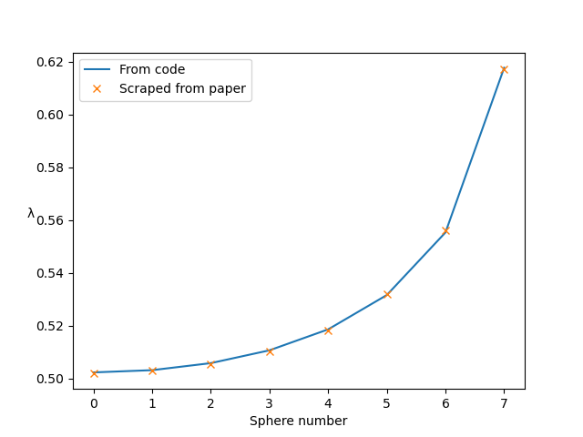
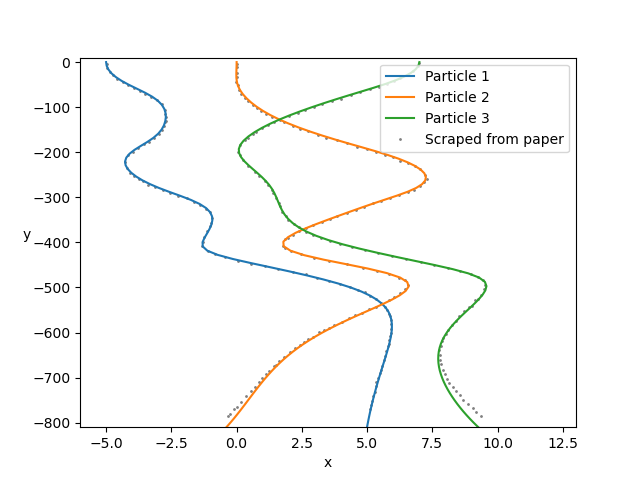

# Stokesian Dynamics in Python: Readme #

This is a Python 3 implementation of [Stokesian Dynamics](http://authors.library.caltech.edu/1600/1/BRAarfm88.pdf) for spherical particles of different sizes.

## Table of contents ##

  * [0. Contact details and how to contribute](#s0)
  * [1. What is Stokesian Dynamics?](#s1)
  * [2. What can this software do?](#s2)
  * [3. What are its limitations?](#s3)
  * [4. System requirements](#s4)
  * [5. How to set up the software](#s5)
  * [6. How to test that the software is working](#s6)
  * [7. How to run your first simulation](#s7)
  * [8. Reading the output](#s8)
  * [9. Changing the inputs](#s9)
  * [10. Examples and comparisons with the literature](#s10)
  * [11. Increasing the number of particle size ratios available](#s11)
  * [12. Idiosyncratic usage notes](#s12)
  * [13. Known issues](#s13)


## 0. Contact details and how to contribute <a name="s0"></a> ##

* This code is written by Adam Townsend ([adamtownsend.com](http://adamtownsend.com/), [@Pecnut](https://twitter.com/pecnut)).
* Feel free to [post in the discussion forum](https://github.com/Pecnut/stokesian-dynamics/discussions) with questions or ideas if you are happy to comment publicly.
* You can also [create a new issue](https://github.com/Pecnut/stokesian-dynamics/issues) in the GitHub repository if you want to report a bug.

## 1. What is Stokesian Dynamics? <a name="s1"></a> ##

Stokesian Dynamics is a microhydrodynamic, low Reynolds number approach<sup>[[1]](#footnote1)</sup> to modelling the movement of suspensions of particles in fluids which considers the interaction of particles with each other against a Newtonian background solvent. It is typically chosen for its suitability for three-dimensional simulation with low calculation and time penalty.

In the most basic case, Stokes’ law states that a single sphere of radius *a*, travelling with a velocity ***U*** in an unbounded Newtonian fluid of viscosity *μ*, in a low Reynolds number regime, experiences a drag force, ***F***, of ***F*** = −6*πμa*__*U*__.

Stokesian Dynamics, at its heart, is an extension of this linear relationship between the force acting on a particle and the velocity at which it travels. As a method, it is adaptable and continues to be used in the field, providing some interesting insight into the behaviour of particle suspensions. Validations with experiments have shown it to provide results within acceptable error.

It is fully explained (in painful detail) in my [PhD thesis](http://discovery.ucl.ac.uk/1559911/).

## 2. What can this software do? <a name="s2"></a> ##

This software allows you to place spherical particles in a fluid, apply some forces to them, and see how they move. You can also move the fluid in some way and see how the particles react to that. You can have a play with a simpler implementation of Stokesian Dynamics in [this nice online version](http://web.mit.edu/swangroup/sd-game.shtml).

In particular, this software has the following features:

* Fully 3D simulation
* Free choice of number of particles
* Choice of simulating particles in an unbounded fluid ('non-periodic') or in a periodic domain
* Free choice of spherical particles sizes (up to *n* different sizes for low *n*)
* Choice to include bead-and-spring dumbbells, formed of pairs of (usually smaller) spherical particles, as a way to introduce viscoelasticity into the background fluid
* Free choice of particle interaction forces
* Choice of whether to include long-range hydrodynamic forces or not (***M***<sup>∞</sup>)
* Choice of whether to include lubrication forces or not (***R***<sup>2B,exact</sup>)
* Choice of Euler, two-step Adams–Bashforth or RK4 timestepping
* Choice of how often to find (***M***<sup>∞</sup>)⁻¹, a matrix which varies slowly and takes a long time to compute, hence is typically computed every 10 timesteps.
* For each spherical, non-bead-and-spring particle in the system, the software takes the forces and torques you want to apply to it, as well as the background fluid shear rate (***F***, ***T*** and ***E***), and gives you the particle velocities, angular velocities and stresslets (***U***, ***Ω*** and ***S***). It can also do ***FTS*** to ***UΩE***, for when you want to specify stresslets instead of the background shear rate; and ***U₁F₂TE*** to ***F₁U₂ΩS***, for when there are some particles whose velocities you want to fix while letting some other particles move under specified forces (e.g. when you want to fix some particles as walls). For the beads in the bead-and-spring dumbbells, which are normally much smaller than the other particles in the system, the only option is to apply the force and extract the velocity (***F*** to ***U***).
* Time-to-completion estimates
* Emails you on completion
* Output stored in convenient .npz format
* Video generation scripts to watch the particle behaviour

## 3. What are its limitations? <a name="s3"></a> ##

Speed and memory are the greatest limitations of the software. Loosely speaking, for a concentrated system of *s* spheres and *d* dumbbells, the memory, in bytes, required, is 48(11*s* + 6*d*)².

## 4. System requirements <a name="s4"></a> ##
This is an implementation in Python, using Numba for speed. It has been tested with Python 3.9.13 and requires the following Python packages:

* matplotlib, numba, numpy, pytest, scipy

Section 5 below explains how to install these packages.

## 5. How to set up the software <a name="s5"></a> ##
The software does not need to be installed. It can be run directly from the folder it is downloaded into.
1. Download the software into its own folder. The easiest way to do this is to navigate to the folder in Terminal that you want to download the Stokesian Dynamics folder into, and to type `git clone` followed by the address you find at the top of this page when you change the SSH dropdown to HTTPS (the address you need should look something like `https://github.com/Pecnut/stokesian-dynamics.git`).
1. Install the required Python packages, or confirm that they are already installed (see section 4), by typing `pip install -r requirements.txt` in Terminal.
1. **You can speed up the code using Numba.** [Numba](https://numba.readthedocs.io/en/stable/user/5minguide.html) is a Python package which can dramatically speed up functions. It does this by optimising functions which are 'decorated' with the `@njit` label in the code. A number of core functions in this software are decorated with this label. Numba is turned OFF by default; turn it on by changing `config.DISABLE_JIT` in `inputs.py` to `False`. The optimisation happens the first time a function is called, so when Numba is enabled, the first timestep will be slow, but the rest will be very fast. It is therefore worth turning on for most simulations.

The software should now be ready to run.

## 6. How to test that the software is working <a name="s6"></a> ##
The software comes with a number of tests which compare the output of the simulation to pre-computed analytic results for two-particle systems in a non-periodic domain. These are stored in the `test` folder, but you don't need to visit this folder in order to run them. Instead:

* Follow the steps in section 5
* Navigate to the main folder in Terminal and type `python -m pytest`.

This will run all the tests in the `test` folder. A successful run will output something like:

```
============================= test session starts ==============================
platform darwin -- Python 3.9.13, pytest-7.1.2, pluggy-1.0.0
rootdir: /.../stokesian-dynamics
plugins: anyio-3.5.0
collected 1 item

test/test_all.py .                                                       [100%]

============================== 1 passed in 4.34s ===============================
```

## 7. How to run your first simulation <a name="s7"></a> ##

* Follow the steps in section 5
* Navigate to the main folder in Terminal and type `python run_simulation.py 2 1 0.5 1`.

This will run a simulation of particles, starting at the positions defined in position setup number `2`, under the forces defined in input setup number `1`, with timestep `0.5`, and for `1` frame.

This simulation is of three spheres of radius 1, arranged horizontally at *x* = –5, 0 and 7. They are all given a downwards force of *F* = 1. The domain is an infinite fluid (i.e. non-periodic).

A successful run will output something like:

```
+--------------------+-------------------+-----------------------+--------------------+
| Setup:    2        | Minfinity: ON     | Matrix form: FTE                           |
| Input:    1        | R2Bexact:  ON     | Solve using: Fast R\F | Video:    OFF      |
| Frames:   1        | Bead-bead: ON     | Inv M every: 10       | Memory:  ~51 KB    |
| Timestep: 0.5      | Timestep:  Euler  | Periodic:    OFF      |                    |
+--------------------+-------------------+--------------------------------------------+
| Save every: 1      | Save after: 0     | Machine: ComputerName                      |
+--------------------+-------------------+--------------------------------------------+
[Generating 1901111302-s2-i1-1fr-t0p5-M10-gravity]
                        [ Minfy  ] [invMinfy] [R2Bex'd'] [ U=R\F  ] [ Saving ] [MaxMemry] [[ Total  ]] [TimeLeft] [ ETA ]
Processing frame 1/1... [    0.0s] [    0.0s] [    0.0s] [    0.1s] [    0.0s] [ 35.8 MB] [[    0.1s]] [    0.0s] [13:02]
[Total time to run     0.6s]
[Complete: 1901111302-s2-i1-1fr-t0p1-M10-gravity]
[Email sent]
```
The top box gives a summary of the job that is executing, including an estimate of how much memory will be required.

After each frame is generated, a list of timings is shown for each part of the process (respectively, creating ***M***<sup>∞</sup>, inverting it, creating ***R***<sup>2B,exact</sup>, solving the mobility formulation, saving the data to disk). Then the maximum memory used in this step is shown. Finally, a countdown to completion and an estimated time of completion is shown.

## 8. Reading the output <a name="s8"></a> ##

You can find the outputs of all your simulations in the **output** folder. Output files are named **yymmddhhmm-s407-i700-1fr-t0p005-...npz**, where yymmddhhmm is replaced by the simulation timestamp in that format (so 1712251500 for 3pm on Christmas Day 2017).

The output is in the convenient .npz format, a zipped Numpy file. It contains various useful Numpy arrays. It can be read with the following Python code, where you have to substitute the filename for `FILENAME`:

```
import numpy as np
data1 = np.load("output/FILENAME.npz")
particle_centres = data1['centres']
dumbbell_displacements = data1['deltax']
forces_on_particles = data1['Fa']
forces_on_dumbbells = data1['Fb']
internal_forces_on_dumbbells = data1['DFb']
particle_stresslets = data1['Sa']
particle_rotations = data1['sphere_rotations']
```

## 9. Changing the inputs <a name="s9"></a> ##

All possible input choices are contained in **inputs.py**.

The most important four, `setup_number`, `input_number`, `timestep`, `num_frames` are set at the top but can also be overwritten by explicitly stating them at the command line, as we did in section 6 above (`python run_simulation.py 2 1 0.5 100`). Simply running `python run_simulation.py` will use the values stated in **inputs.py**.

* The variable `setup_number` corresponds to the initial particle configuration in **position_setups.py**, containing initial particle positions and sizes in a big 'if' list.

* The variable `input_number` corresponds to the forces, torques and background fluid velocities (as well as anything else being imposed on the particles) in **input_setups.py**.

When creating new setup_number and input_number cases, use the existing cases as templates.

The other variables are (hopefully) explained in the comments of **inputs.py**.

**Note**: as received, the software is only able to perform simulations with particles of size ratio 1:1, 1:10 and 1:100. To increase this, see section 10.

### Types of behaviour you can impose

The most common use case is that you want to impose particle forces (***F***), particle torques (***T***) and background strain rate (***E***), and therefore that you want to output particle velocities (***U***), particle angular velocities (***Ω***) and particle stresslets (***S***). However, this is not the only option in this code. You may want to impose ***F***, ***T***, ***S*** and output ***U***, ***Ω***, ***E***. Or you may wish to impose a mix of particle velocities and forces, for example if you have some particles acting as rigid bodies or lids, and some particles being free to move. So long as all particles in the system have some behaviour imposed on them, you can implement this behaviour in the code by changing the variable `input_form` in **inputs.py**, or by adding an appropriate flag to the end of the command line:

* Impose ***FTE***: use `fte` or nothing
* Impose ***FTS*** or you are just running a simulation with no spheres, only dumbbells: use `fts`
* Impose some ***U***, some ***F***, and ***TE***: use `ufte`.

Examples:

* Usual ***FTE*** behaviour: `python run_simulation.py 2 1 0.5 100` or `python run_simulation.py 2 1 0.5 100 fte`
* Mix of ***U***/***F***, along with ***TE***: `python run_simulation.py 6 5 1 1 ufte`

If you see errors involving 'pippa', it's normally because you have got this wrong.

## 10. Examples and comparisons with the literature <a name="s10"></a> ##

The files **position_setups.py** and **input_setups.py** come with some example setups. In these examples, the 'vertical' direction is the –*z* direction. Set `view_graphics = True` to watch these simulations.

### (a) Fig. 1 of Durlofsky et al. (1987) (non-periodic)
[Durlofsky, Brady & Bossis, 1987](https://doi.org/10.1017/S002211208700171X). Dynamic simulation of hydrodynamically interacting particles. *Journal of Fluid Mechanics* **180**, 21–49. Figure 5.

This test case looks at horizontal chains of 5, 9 and 15 spheres sedimenting vertically. The instantaneous drag coefficient, *λ*=*F*/(6π*μaU*), is measured for each sphere in the chain, in each case. Here we set up the chain of length 15. Running for 1 timestep<sup>[[2]](#footnote2)</sup>, reading the velocity *U* and calculating *λ* reproduces this graph.

Run `python run_simulation.py 1 1 1 1 fte` (position setup number 1, forces input 1, with a timestep of 1 [arbitrary choice] for 1 timestep, specifying forces, torques and rate of strain).

Follow the instructions in `examples/example-a.py` to produce the following graph, comparing the results from this simulation to the figure in the paper:



### (b) Fig. 5 of Durlofsky et al. (1987) (non-periodic)
[Durlofsky, Brady & Bossis, 1987](https://doi.org/10.1017/S002211208700171X). Dynamic simulation of hydrodynamically interacting particles. *Journal of Fluid Mechanics* **180**, 21–49. Figure 5.

This test case considers three horizontally-aligned particles sedimenting vertically, and looks at their interesting paths over a large number of timesteps. Use RK4 timestepping (set `timestepping_scheme = 'rk4'`) and ensure `invert_m_every` is set to 1, in order to recover the same particle paths.

Run `python run_simulation.py 2 1 128 100 fte`.

Follow the instructions in `examples/example-b.py` to produce the following graph, comparing the results from this simulation to the figure in the paper:




### (c) Fig. 1 of Brady et al. (1988) (periodic)
[Sierou & Brady, 2001](https://doi.org/10.1017/S0022112001005912). Accelerated Stokesian Dynamics simulations. *Journal of Fluid Mechanics*, **448**, 115--146. Figure 9.
Correction to
[Brady, Phillips, Lester & Bossis, 1988](https://doi.org/10.1017/S0022112088002411). Dynamic simulation of hydrodynamically interacting suspensions. *Journal of Fluid Mechanics* **195**, 257–280. Figure 1.

A simple cubic array sediments vertically under a constant force. The velocity is measured for different particle concentrations. Vary the concentration by altering the cubic lattice size.

Note that a periodic domain is activated by setting `box_bottom_left` and `box_top_right` to be different in **input_setups.py**. Make sure `how_far_to_reproduce_gridpoints` ≥ 2 for accurate results.

Run `python run_simulation.py 3 2 1 1 fte`.

Follow the instructions in `examples/example-c.py` to produce the following graph, comparing the results from this simulation to the figure in the paper:


### (d) Two spheres, two dumbbells in oscillatory background flow
Arrange two large spheres and two dumbbells in a square, then put in an oscillatory background flow. Set the dumbbell spring constant.

Run `python run_simulation.py 4 3 1 100 fte`.

### (e) Randomly arranged spheres, with repulsive forces between them
Randomly arrange spheres in a 2D box in the *xz*-plane. Place a repulsive force between them so that they spread out.

Run `python run_simulation.py 5 4 1 1 fte`.

### (f) Randomly arranged dumbbells between two walls of spheres which have a specified velocity
Create two walls of spheres, with dumbbells randomly arranged between them. Then force the walls to move at given speeds. Observe what happens to the dumbbells.

This time we need the `ufte` flag because we are specifying velocities.

Run `python run_simulation.py 6 5 1 1 ufte`.

### (g) Replicating an existing output file
Use the function `same_setup_as('FILENAME', frameno=0)` in **position_setups.py** to copy the setup from a certain file, starting at a given frame number.

Run `python run_simulation.py 7 1 1 1 fte`.

## 11. Increasing the number of particle size ratios available <a name="s11"></a> ##
By default, the software comes with the precomputed resistance data for particles of size ratio 1:1, 1:10 and 1:100. To increase this:

* Open the folder **find_resistance_scalars**
* Add the size ratios to the file **values_of_lambda.txt**
* Then follow the instructions in section 3 of [**find_resistance_scalars/README.md**](find_resistance_scalars/README.md)

This last step requires you to compile some Fortran code and run a Mathematica script; the instructions are all in the aforementioned README file. Calculating this data can take about an hour on a contemporary laptop, so give yourself some time.

The method is from:

* [Townsend, 2023](https://doi.org/10.1063/5.0175697). Generating, from scratch, the near-field asymptotic forms of scalar resistance functions for two unequal rigid spheres in low Reynolds number flow, *Physics of Fluids* **35**(12), 127126.
* [Wilson, 2013](http://www.ucl.ac.uk/~ucahhwi/publist/papers/2013-W.pdf). Stokes flow past three spheres, *Journal of Computational Physics* **245**, 302–316.

## 12. Known issues <a name="s12"></a> ##

### (a) "RuntimeError: Invalid DISPLAY variable" error

This error occurs when you try to plot an image on a remote server without a working display.

**Remedy:** Set `view_graphics = False` in `inputs.py`.

**Reason:** If `view_graphics = True`, the timesteps are looped over using `animation.FuncAnimation`, which allows you to see what's going on in the simulation in 'real time'. If `view_graphics = False`, then the timesteps are looped over just with a for loop, bypassing the plotting functionality completely.

This is a common error when working on a remote server. If you set `view_graphics = False`, you can pick up the output data from the `/output/` folder and create the video yourself on your own machine.

### (b) "NameError: global name 'saved_Fa_out' is not defined" error

This error occurs when the main body of the code (`generate_frame`) has not been called before the code tries to finish.

**Probable remedy:** Set `view_graphics = False` in `inputs.py` or, remove `matplotlib.use('agg')` if you have added this.

**Reason:** If `view_graphics = True`, the timesteps are looped over using `animation.FuncAnimation`, which allows you to see what's going on in the simulation in 'real time'. If `view_graphics = False`, then the timesteps are looped over just with a for loop, bypassing the plotting functionality completely.

The normal cause of this error is that `view_graphics = True`, but despite this, `animation.FuncAnimation` has not functioned correctly. This happens if you change the matplotlib backend to a backend such as `Agg` which does not require a working display: see [the Agg backend is not compatible with animation.FuncAnimation](https://github.com/matplotlib/matplotlib/issues/2552/).


<hr>

<a name="footnote1">[1]</a> This means it solves the [Stokes equation](https://en.wikipedia.org/wiki/Stokes_flow#Stokes_equations) rather than the [Navier–Stokes equation](https://en.wikipedia.org/wiki/Navier%E2%80%93Stokes_equations#General_continuum_equations).

<a name="footnote2">[2]</a> Euler timestep: make sure `timestepping_scheme = 'euler'` in **inputs.py**
